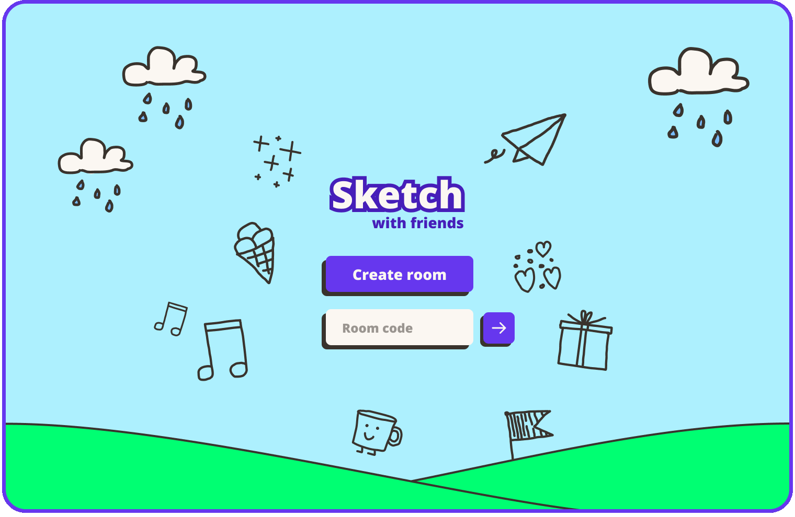

  <picture>
    <source srcset="./.github/images/logo.svg">
    
  </picture>

  
  

## Overview

Sketch with Friends is a real-time multiplayer drawing game. Players take turns
sketching and guessing words. Create private rooms for you and your friends or
play with people from around the world.

 
    

### Features

- 🌍 **Global Matchmaking:** Connect with players worldwide
- 💬 **In-Game Chat:** Communicate with other players in real-time
- 📱 **Mobile Support:** Full touch and keyboard support
- 🔒 **Private Rooms:** Create private rooms for you and your friends
- 🎨 **Custom Words:** Bring your own custom words to the guessing pool

## Local development

- [Frontend](frontend/README.md)
- [Backend](realtime/README.md)

## Contributing

If you're looking to contribute to Sketch with Friends or any of our other
projects, we'd love your help! Shoot us an email at
[hello@walagames.com](mailto:hello@walagames.com) and we'll get you set up.
